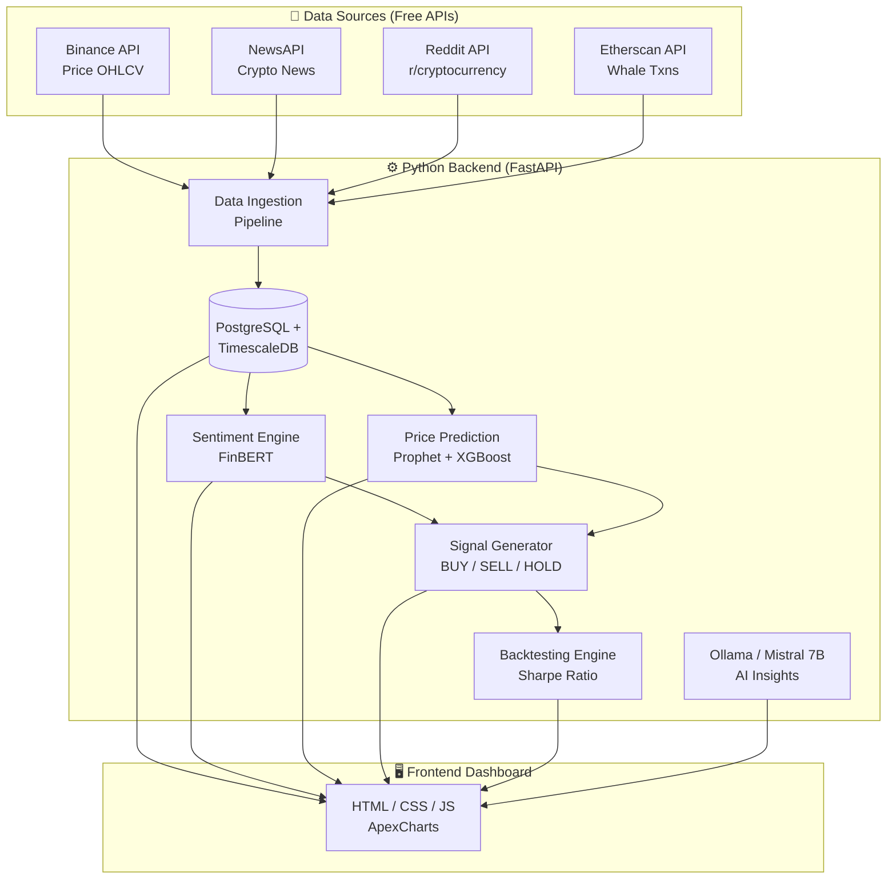

<](https://python.org)
[](https://docs.docker.com/compose/)
[](https://huggingface.co/mistralai/Mistral-7B-v0.1)
[](LICENSE)

*Analyze sentiment. Predict prices. Generate actionable BUY / SELL / HOLD signals — all running locally on your hardware.*

---

</div>

## 📌 Overview

The **Crypto Intelligence Terminal** is a fully self-hosted, hybrid-compute AI pipeline for cryptocurrency sentiment analysis and price prediction. It combines traditional quantitative modeling (XGBoost, Prophet, LSTM) with state-of-the-art generative AI (Mistral-7B via QLoRA fine-tuning) to deliver an end-to-end framework for data-driven trading decisions — with zero reliance on expensive third-party APIs or cloud-hosted foundation models.

> **Why self-hosted?** Full data privacy, no recurring API costs, complete control over model behavior, and the freedom to fine-tune on your own market thesis.

---

## ✨ Key Features

| Feature | Description |
|---------|-------------|
| 📡 **Real-Time Data Ingestion** | Continuous streams from Binance (OHLCV), NewsAPI, Reddit (`r/cryptocurrency`), and Etherscan (whale transactions). |
| 🤖 **AI-Powered Sentiment Analysis** | Locally hosted Ollama Mistral-7B + FinBERT for deep contextual understanding of market narratives. |
| 📈 **Multi-Model Price Prediction** | Ensemble of Prophet (trend decomposition), LSTM (temporal memory), and XGBoost (gradient boosting). |
| 🎯 **Intelligent Signal Generation** | Definitive BUY / SELL / HOLD signals with confidence scores and explainability metrics. |
| 🔄 **Backtesting Engine** | Validates historical accuracy using Sharpe Ratio, directional accuracy, and drawdown analysis. |
| 📊 **Unified Dashboards** | Animated web dashboard (HTML/CSS/JS + Lightweight Charts) and CLI-based rich terminal UI. |
| 🏗️ **Fully Containerized** | Single-command Docker Compose deployment with automatic GPU/CPU fallback. |

---

## 🏛️ System Architecture



---

## 📋 System Requirements

| Requirement | Minimum | Recommended |
|-------------|---------|-------------|
| **Python** | 3.9+ | 3.11+ |
| **Docker** | Docker Engine + Compose | Docker Desktop (latest) |
| **System RAM** | 16 GB | 32 GB |
| **GPU (Optional)** | — | NVIDIA GPU with 8 GB+ VRAM (CUDA-compatible) |

> **Note:** A GPU is optional but strongly recommended for QLoRA fine-tuning and accelerated Mistral-7B inference. The system automatically falls back to CPU if no compatible GPU is detected.

---

## 🚀 Quick Start

### 1. Clone & Configure

```bash
git clone https://github.com/MasterManoj9/Crypto_terminal.git
cd Crypto_terminal
cp .env.example .env
```

Open `.env` in your editor and insert your API keys:

```env
BINANCE_API_KEY=your_binance_api_key
BINANCE_API_SECRET=your_binance_secret
NEWS_API_KEY=your_newsapi_key
REDDIT_CLIENT_ID=your_reddit_client_id
REDDIT_CLIENT_SECRET=your_reddit_secret
ETHERSCAN_API_KEY=your_etherscan_key
```

> **Tip:** You can also configure API keys directly from the frontend dashboard after deployment.

### 2. Deploy with Docker Compose

```bash
docker-compose up -d --build
```

Once running, navigate to **`http://localhost:8501`** in your browser. The dashboard opens directly — no login required — and immediately begins streaming live backend data.

### 3. Alternative: Platform-Specific Scripts

```powershell
# Windows
./scripts/deploy_model.ps1
```

```bash
# Linux / macOS
./scripts/deploy_model.sh
```

These scripts perform automatic environment checks (Docker availability, GPU detection, port conflicts) before launching the cluster.

---

## 🧹 Teardown & Cleanup

**Stop all containers:**

```bash
docker-compose down
```

**Full reset** (removes containers, images, and database volumes):

```bash
docker-compose down --rmi all -v
```

---

## 🔬 How the Prediction Pipeline Works

The system employs a **multi-modal forecasting approach** that fuses quantitative signals with natural-language market intelligence.

### Stage 1 — Continuous Data Ingestion

The pipeline operates around the clock using your configured API keys, aggregating the latest OHLCV price data, crypto news articles, whale transactions, and Reddit discussions into a PostgreSQL (TimescaleDB) datastore.

### Stage 2 — AI Inference & Sentiment Extraction

FinBERT and Ollama-powered Mistral-7B process raw textual feeds to extract contextual market sentiment. The models distinguish between genuine market shifts and noise, producing a normalized **Bullish / Bearish Sentiment Score**.

### Stage 3 — Quantitative Price Prediction

Prophet (trend decomposition) and XGBoost (gradient boosting) concurrently analyze historical time-series data. Traditional technical indicators — Moving Averages, RSI, Bollinger Bands — are computed from OHLCV candles and fed as features.

### Stage 4 — Signal Aggregation

The Signal Generator cross-references sentiment scores with quantitative forecasts to produce actionable **BUY / SELL / HOLD** signals, each annotated with:
- A **confidence metric** reflecting inter-model agreement
- A **narrative explanation** of the reasoning behind each signal

### Stage 5 — Backtesting & Validation

The backtesting engine evaluates signals against historical data, computing risk-adjusted performance metrics (Sharpe Ratio, drawdown, win rate) to ensure the models generalize beyond in-sample data.

### Stage 6 — Dashboard Presentation

The unified frontend surfaces all indicators, predictions, and signals in a live animated dashboard powered by Lightweight Charts and ApexCharts.

---

## ⚡ GPU & CPU Runtime Strategy

The architecture implements **automatic split-runtime deployment** to maximize hardware utilization:

| Component | Runtime | Rationale |
|-----------|---------|-----------|
| Mistral-7B Inference | **GPU** (via Ollama container) | Token generation is compute-bound and benefits heavily from CUDA acceleration. |
| RAG Context Retrieval | **CPU** (`RAG_CONTEXT_CPU_ONLY=true`) | Vector embeddings and database queries are I/O-bound and don't require GPU. |
| FinBERT Sentiment | **CPU / GPU** (auto-detected) | Lightweight transformer — runs efficiently on either. |
| XGBoost / Prophet | **CPU** | Traditional ML models with negligible GPU benefit at this scale. |

### Automatic Fallback Behavior

1. On startup, the backend probes `/api/v1/model/runtime` to verify CUDA availability.
2. If no compatible GPU or insufficient VRAM is detected, the inference containers automatically restart in **CPU-only mode**.
3. You can force CPU-only operation at any time:

   ```bash
   # Force CPU-based LoRA fine-tuning
   ./scripts/deploy_model.sh -FineTuneTrainerMode cpu-lora
   ```

---

## 🧬 Mistral-7B Optimization Stack

Three complementary techniques ensure the 7-billion-parameter model runs efficiently on consumer hardware:

### 4-Bit Quantization (QLoRA)

The base Mistral model is quantized to **NF4 (4-bit NormalFloat)** precision using `bitsandbytes`. This reduces VRAM requirements by ~75% for both inference and fine-tuning, with negligible impact on reasoning quality.

### Low-Rank Adaptation (LoRA)

Instead of updating all 7B parameters, small trainable rank-decomposition matrices are injected into attention layers. Only the weights critical for financial sentiment interpretation are trained — yielding **10–100× faster fine-tuning** compared to full-parameter updates.

### Split-Workload RAG

Generative text streaming is pinned to the GPU via Ollama, while retrieval operations (vector similarity search, database routing) are offloaded to the CPU. This cleanly partitions scarce GPU memory for maximum throughput.

---

## 📊 Performance Benchmarks

> **Snapshot Date:** 2026-04-02 — evaluated against live `price_data` in PostgreSQL.

### Runtime Configuration

| Parameter | Value |
|-----------|-------|
| TensorFlow LSTM GPU Available | `false` (CPU fallback on native Windows) |
| Evaluated Market Series | 10 total |
| Assets Covered | BTC, ETH, DOGE |
| Intervals Covered | 15m, 1h, 4h, 1d |
| Evaluation Window | Latest 900 rows per symbol/interval |

### Aggregate Model Performance

| Model Path | Directional Accuracy | Sharpe Ratio | Signal Win Rate | Total Trades |
|------------|:--------------------:|:------------:|:---------------:|:------------:|
| **CPU** — `GradientBoostingRegressor` | **52.44%** | **4.5398** | **30.23%** | 210 |
| **GPU** — `TensorFlow LSTM` | 49.44% | -1.3907 | 1.43% | 8 |

### Per-Asset Breakdown

| Asset | CPU Accuracy | CPU Sharpe | CPU Win Rate | CPU Trades | GPU Accuracy | GPU Sharpe | GPU Win Rate | GPU Trades |
|:-----:|:------------:|:----------:|:------------:|:----------:|:------------:|:----------:|:------------:|:----------:|
| **BTC** | 52.08% | 1.8146 | 29.54% | 53 | 51.26% | 0.0000 | 0.00% | 0 |
| **ETH** | 53.89% | 7.7973 | 33.86% | 103 | 50.28% | 0.0000 | 0.00% | 0 |
| **DOGE** | 50.28% | 3.4752 | 24.33% | 54 | 44.13% | -6.9534 | 7.14% | 8 |

<details>
<summary><strong>📋 Full Interval-Level Breakdown</strong></summary>

| Series | CPU Accuracy | CPU Sharpe | CPU Win Rate | GPU Accuracy | GPU Sharpe | GPU Win Rate |
|--------|:------------:|:----------:|:------------:|:------------:|:----------:|:------------:|
| BTCUSDT 15m | 54.44% | 11.0564 | 36.00% | 47.49% | 0.0000 | 0.00% |
| BTCUSDT 1h | 55.56% | 3.4250 | 23.81% | 50.84% | 0.0000 | 0.00% |
| BTCUSDT 4h | 52.78% | 9.8752 | 25.00% | 51.96% | 0.0000 | 0.00% |
| BTCUSDT 1d | 45.56% | -17.0983 | 33.33% | 54.75% | 0.0000 | 0.00% |
| DOGEUSDT 4h | 55.00% | 15.6140 | 26.09% | 48.60% | 0.7579 | 0.00% |
| DOGEUSDT 1d | 45.56% | -8.6637 | 22.58% | 39.66% | -14.6648 | 14.29% |
| ETHUSDT 15m | 52.22% | 8.8520 | 32.00% | 49.72% | 0.0000 | 0.00% |
| ETHUSDT 1h | 55.00% | 5.1060 | 35.71% | 50.28% | 0.0000 | 0.00% |
| ETHUSDT 4h | 53.89% | 23.6538 | 45.00% | 48.60% | 0.0000 | 0.00% |
| ETHUSDT 1d | 54.44% | -6.4225 | 22.73% | 52.51% | 0.0000 | 0.00% |

</details>

### Scoring Methodology

| Metric | Definition |
|--------|------------|
| **Directional Accuracy** | Percentage of correct next-candle direction predictions. |
| **Sharpe Ratio** | Annualized return-to-risk ratio computed from the strategy's equity curve. |
| **Signal Win Rate** | Percentage of closed trades that were profitable. |

---

## 📐 Mathematical Foundations

The prediction pipeline is grounded in rigorous mathematical formulations across six core components.

### 1. Ensemble Consensus

The final directional probability $P$ for class $c$ is a weighted fusion of three independent forecasting paradigms:

$$P_{\text{ensemble}}(c) = 0.3 \cdot P_{\text{prophet}}(c) + 0.4 \cdot P_{\text{lstm}}(c) + 0.3 \cdot P_{\text{xgb}}(c)$$

> **Design rationale:** LSTM receives the highest weight (0.4) due to its superior capacity for capturing non-linear temporal dependencies in volatile crypto markets.

### 2. Structural Trend Decomposition (Prophet)

Price series are decomposed into interpretable additive components:

$$y(t) = g(t) + s(t) + h(t) + \epsilon_t$$

| Symbol | Component | Description |
|:------:|-----------|-------------|
| $g(t)$ | Growth trend | Piecewise linear function capturing long-term price direction. |
| $s(t)$ | Seasonality | Fourier series modeling intraday, daily, and weekly periodicity. |
| $h(t)$ | Holidays/Events | Impulse responses for anomalous market events (e.g., halving, regulatory news). |
| $\epsilon_t$ | Residual | Irreducible noise term. |

### 3. Temporal Memory Gates (LSTM)

The LSTM architecture maintains long-range market context through three gating mechanisms:

$$f_t = \sigma(W_f \cdot [h_{t-1}, x_t] + b_f) \quad \text{— Forget Gate (information decay)}$$

$$i_t = \sigma(W_i \cdot [h_{t-1}, x_t] + b_i) \quad \text{— Input Gate (feature selection)}$$

$$C_t = f_t \odot C_{t-1} + i_t \odot \tanh(W_C \cdot [h_{t-1}, x_t] + b_C) \quad \text{— Cell State (persistent memory)}$$

### 4. Regularized Gradient Boosting (XGBoost)

Trees are constructed iteratively to minimize a regularized objective that penalizes complexity:

$$\mathcal{L}(\phi) = \sum_{i} l(\hat{y}_i, y_i) + \gamma T + \frac{1}{2}\lambda \sum_{j} w_j^2$$

| Symbol | Meaning |
|:------:|---------|
| $l(\hat{y}_i, y_i)$ | Differentiable loss function (e.g., squared error). |
| $\gamma T$ | Penalty proportional to the number of leaf nodes — prevents overfitting. |
| $\lambda \sum w_j^2$ | L2 regularization on leaf weights — ensures smooth predictions. |

### 5. Parameter-Efficient Adaptation (QLoRA)

Mistral-7B is adapted to crypto-sentiment tasks without full-parameter training:

$$W_{\text{adapted}} = W_{\text{NF4}} + (A \times B) \cdot \frac{\alpha}{r}$$

| Symbol | Meaning |
|:------:|---------|
| $W_{\text{NF4}}$ | Frozen base weights quantized to 4-bit NormalFloat precision. |
| $A \times B$ | Low-rank decomposition matrices (trainable). |
| $\alpha / r$ | Scaling factor controlling adaptation magnitude. |

### 6. Risk-Adjusted Validation

| Metric | Formula | Purpose |
|--------|---------|---------|
| **Directional Accuracy** | $\text{Acc} = \frac{1}{N} \sum \mathbb{1}(\text{sgn}(\Delta \hat{y}) = \text{sgn}(\Delta y))$ | Measures prediction "hit rate" for next-candle direction. |
| **Sharpe Ratio** | $S = \frac{\mu_{\text{returns}}}{\sigma_{\text{returns}}}$ | Normalizes profit against trading risk (higher = better). |
| **Confidence Score** | $\text{Conf} = \left( \frac{1}{M} \sum \max(P_m) \right) \times k$ | Quantifies inter-model agreement; high values indicate consensus. |

---

## 🗂️ Project Structure

```
Crypto_terminal/
├── docker-compose.yml          # Primary orchestration file
├── docker-compose.gpu.yml      # GPU-specific overrides
├── .env.example                # API key template
├── backend/
│   ├── app/
│   │   ├── api/                # FastAPI route handlers
│   │   ├── models/             # Prophet, LSTM, XGBoost model definitions
│   │   ├── services/           # Data ingestion, sentiment, signal generation
│   │   └── core/               # Configuration, database, utilities
│   ├── Dockerfile
│   └── requirements.txt
├── frontend/
│   ├── index.html              # Dashboard entry point
│   ├── css/                    # Stylesheets
│   └── js/                     # Chart rendering, API polling, UI logic
├── scripts/
│   ├── deploy_model.sh         # Linux/macOS deployment
│   └── deploy_model.ps1        # Windows deployment
└── ollama/
    └── Modelfile               # Mistral-7B configuration for Ollama
```

---

## 🤝 Contributing

Contributions are welcome! Please open an issue first to discuss proposed changes, then submit a pull request against the `main` branch.

---

## 📄 License

This project is licensed under the [MIT License](LICENSE).

---

<div align="center">

**Built with ❤️ for the open-source crypto community.**

*If this project helped you, consider giving it a ⭐ on GitHub.*

</div>
]]>
